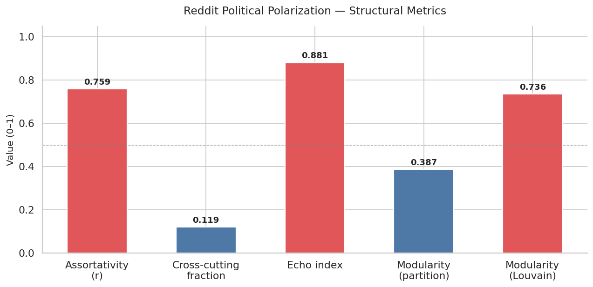
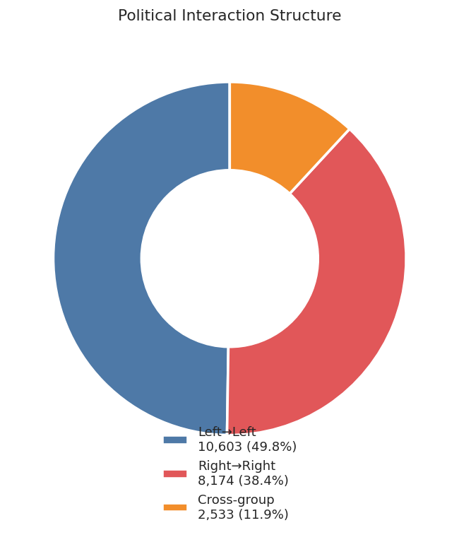
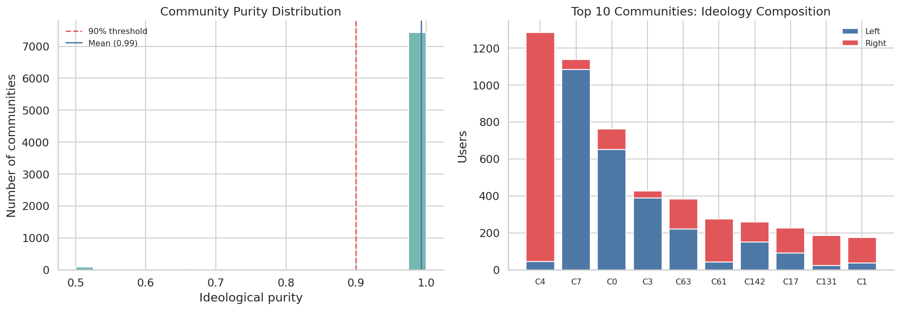
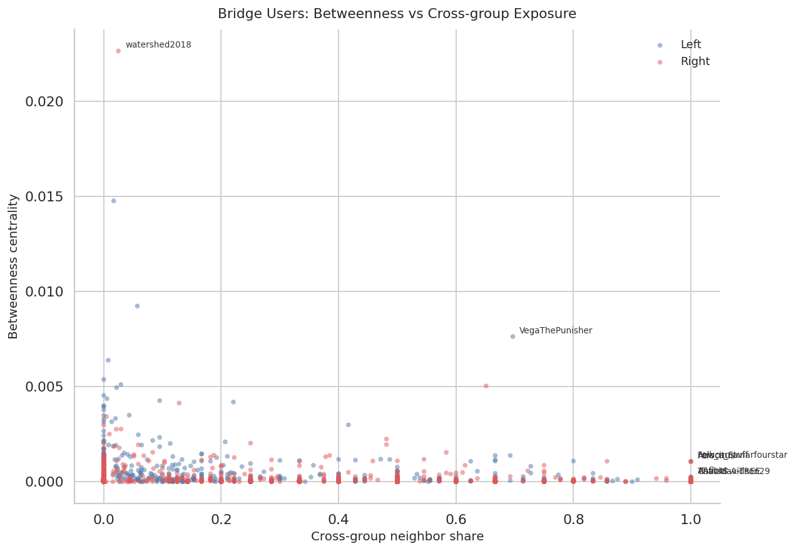
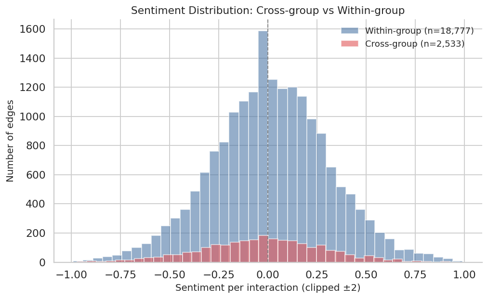
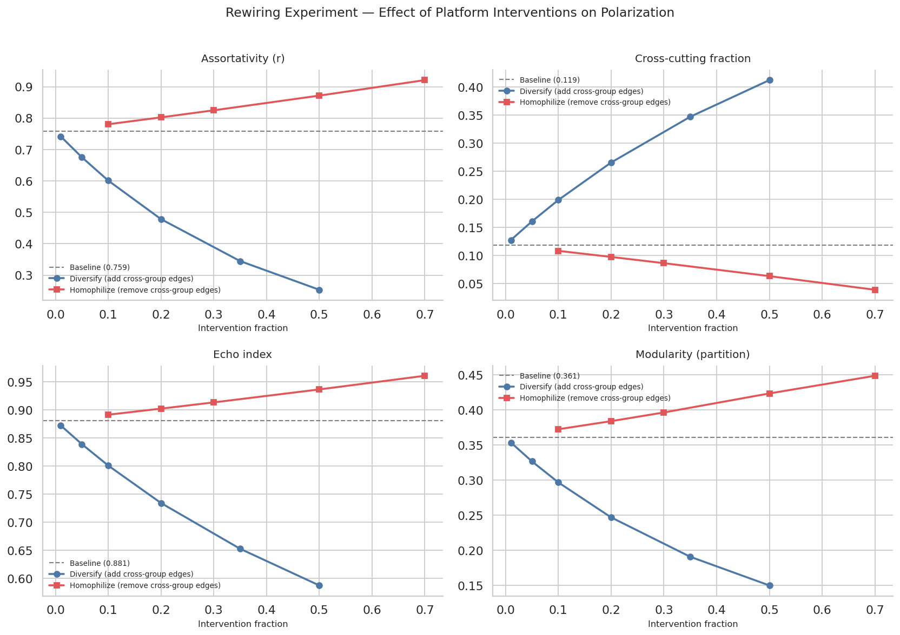
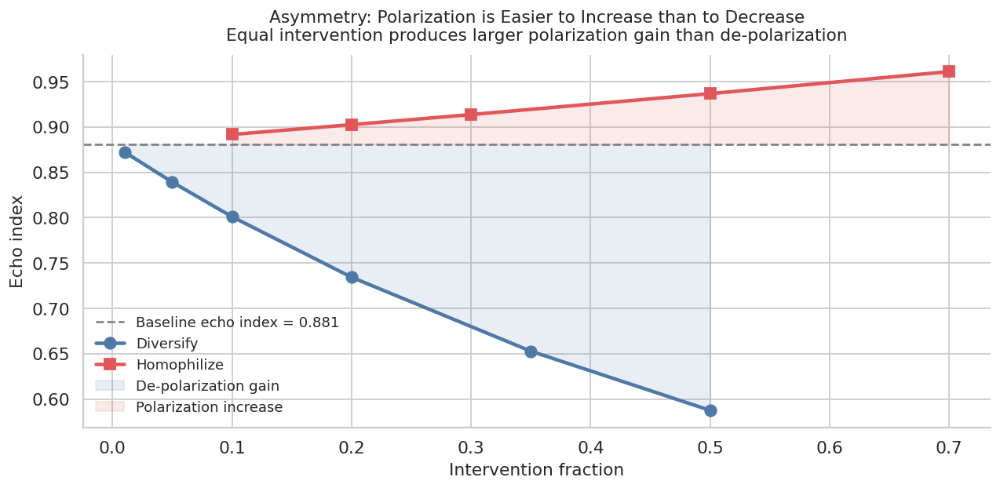
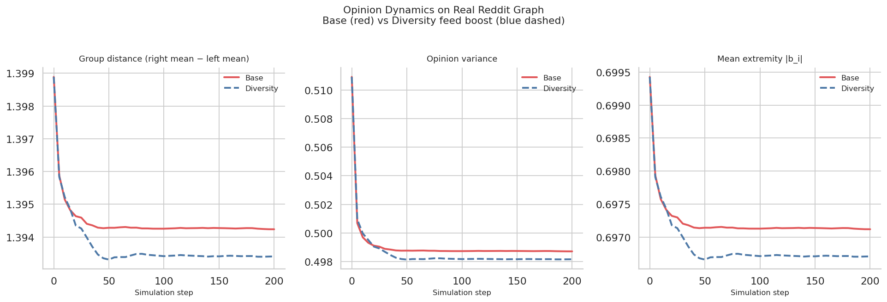

# Reddit Political Polarization Lab — Research Report

**Project:** `reddit-polarization-lab`  
**Tagline:** Network-based measurement and visualization of polarization on Reddit  
**Date:** June 2026  
**Author:** Matteo Melis  
**Environment:** Laptop CPU · Python 3 · NetworkX · scikit-learn · pandas · matplotlib

---

## Abstract

This report documents the design, implementation, and empirical findings of a structural network analysis of political polarization on Reddit. Using a large-scale open Reddit dump (12.67M submissions, 85.91M user relations, 6.56M unique users), we construct a directed user–user interaction graph, assign ideology labels via subreddit mapping, and compute structural polarization metrics including assortativity, modularity, echo index, and cross-cutting ties. Results confirm strong echo-chamber structure: assortativity \(r = 0.759\), echo index \(= 0.881\), and Louvain modularity \(= 0.736\), with 98.3% of detected communities exceeding 90% ideological purity. Counterfactual rewiring experiments reveal a striking asymmetry: de-polarization through diversity interventions requires 3.6× more structural perturbation than equivalent homophilization. Opinion dynamics simulations on the real graph confirm that diversity feed boosts produce small but consistent reductions in group distance and opinion variance. Taken together, these findings position Reddit as a structurally polarized environment comparable to — and in several metrics exceeding — previously reported values for Twitter and Facebook political networks.

---

## 1. Introduction

Political polarization on social media has become a central concern in computational social science, political communication, and platform governance. The worry is not merely that users hold divergent opinions, but that the *structure* of online interaction networks reinforces and amplifies those differences through homophily, selective exposure, and algorithmic content curation. When users predominantly interact with ideologically similar peers, the network develops echo chambers: densely connected within-group clusters with sparse cross-group bridging.

Reddit presents a particularly interesting case. Unlike Twitter's follower-based architecture or Facebook's explicit friendship graph, Reddit organizes users through topic-specific communities (subreddits) where interaction is driven by content rather than direct social relationships. Some researchers have argued this makes Reddit more resistant to polarization. Recent empirical work challenges this assumption, showing clear polarization in Reddit's interaction and topic-based communities, particularly during election periods.

This project takes a structural, measurement-first approach. Rather than relying on NLP classification or survey-based attitude measurement, we construct user–user interaction networks from reply data and apply graph-theoretic polarization metrics. The goal is twofold: (1) to characterize the empirical state of political polarization in the Reddit graph, and (2) to quantify, through counterfactual simulation, the structural effects of hypothetical platform interventions.

---

## 2. Theoretical Background

### 2.1 Opinion and Network Polarization

Polarization has both *opinion* and *structural* dimensions. Opinion polarization refers to a distribution of political attitudes that becomes bimodal — clustered at extremes with reduced overlap or moderation. Network polarization refers to the concentration of social ties within ideologically similar groups (homophily), producing echo chambers with low cross-group connectivity.

These two dimensions are related but distinct. A network can be structurally segregated even when individual opinions remain moderate; conversely, divergent opinions may coexist in a well-connected, cross-cutting network. This project focuses primarily on structural indicators, which are directly observable from interaction data without requiring opinion measurement.

Homophily — the tendency for like to associate with like — is a fundamental organizing principle of social networks and a direct driver of structural polarization. Higher social connectivity, particularly when mediated by homophilous network mechanisms, increases the probability that individuals cluster with like-minded peers, exacerbating ideological divides. Computational models confirm that as social networks grow under homophily constraints, polarization intensifies rather than diffuses.

### 2.2 Structural Polarization Metrics

The following structural metrics are used throughout this report:

**Assortativity (r):** The Pearson correlation coefficient of ideology labels across connected node pairs, as defined by Newman (2003). A value of 1.0 indicates perfect within-group connection; 0 indicates random mixing; negative values indicate disassortative (cross-group) preference. For social networks with political content, values above 0.5 are considered high; this project observes \(r = 0.759\).

Formally, for a network with node attribute \(x_i\):
\[
r = \frac{\sum_{ij}(A_{ij} - k_i k_j / 2m) x_i x_j}{\sum_{ij}(k_i \delta_{ij} - k_i k_j / 2m) x_i x_j}
\]
where \(A_{ij}\) is the adjacency matrix, \(k_i\) the degree of node \(i\), and \(m\) the total number of edges.

**Modularity (Q):** A scalar measure of how well a network partitions into communities with dense internal and sparse external connections. Modularity is maximized at \(Q = 1\) (perfect separation) and equals 0 for random graphs. Two versions are computed: (1) *partition modularity* \(Q_{partition}\), based on ideology labels as the community assignment, measuring how well left/right alignment predicts the community structure; and (2) *Louvain modularity* \(Q_{Louvain}\), the maximum modularity achievable by the Louvain greedy optimization algorithm regardless of external labels.

**Echo Index:** The fraction of all edges that connect two nodes of the same ideology label. Complementary to the cross-cutting fraction, it directly measures within-group enclosure.

**Cross-cutting Fraction:** The fraction of all edges that connect nodes of opposite ideology. Values below 0.2 are considered indicative of echo-chamber structure in the literature.

**Community Purity:** For each Louvain-detected community, the fraction of nodes belonging to the majority ideology. Mean purity close to 1.0 indicates mono-ideological communities.

### 2.3 Ideology Assignment

Two levels of ideology labeling are used:

1. **Subreddit-level:** Each subreddit is assigned to one of five categories — `left`, `right`, `general`, `non_political` — using a manually curated YAML mapping informed by prior empirical studies of Reddit's political landscape, including work identifying partisan subreddits by user activity patterns. The present dataset includes 197,870 unique subreddits; labeling was applied to the 40+ subreddits with clear political character, including `The_Donald` (right) and progressive/liberal subreddits (left).

2. **User-level:** Each user's ideology is derived as the argmax of their weighted activity across labeled subreddits, with a 60% majority threshold for definitive left/right assignment. Users below this threshold are labeled `mixed`; users with no activity in political subreddits are labeled `non_political`.

**Limitations:** Subreddit-level labeling collapses multidimensional ideological space to a single left/right axis — a simplification that ignores libertarian, nationalist, single-issue, or issue-specific communities. User-level aggregation may conflate cross-posting with genuine ideological moderation. Label noise is highest for `general` and `mixed` users.

### 2.4 Network Construction

Two graph types are constructed:

**User–User Reply Network (\(G_{user}\)):** A directed graph where an edge \(i \to j\) is created if user \(i\) replies to content authored by user \(j\), with edge weight equal to the interaction count. This approximates an exposure or influence network: an edge implies that user \(i\) has read and responded to user \(j\)'s content.

**User–Subreddit Affiliation Network (\(G_{bip}\)):** A bipartite graph connecting users to subreddits where they post, with edge weights reflecting comment counts. Projections of this graph yield user–user similarity networks (shared subreddit activity) and subreddit co-audience networks.

Unlike pure agent-based models (ABMs), this approach operates on *observed* interaction networks derived from real behavior. Simulations (rewiring, opinion dynamics) are run on top of this empirical scaffold rather than on synthetic generative graphs.

### 2.5 Opinion Dynamics Models

For the what-if simulation component, a bounded-confidence update rule is applied to the real \(G_{user}\) graph. In the bounded-confidence model (BCM), agents update their opinion only when the opinion distance to a neighbor falls within a confidence threshold \(\epsilon\). Formally, at each step, agent \(i\) samples \(k\) neighbors and updates:

\[
b_i(t+1) = b_i(t) + \frac{\mu}{|N_\epsilon(i)|} \sum_{j \in N_\epsilon(i)} (b_j(t) - b_i(t))
\]

where \(N_\epsilon(i) = \{j : |b_j - b_i| < \epsilon\}\) is the set of neighbors within confidence distance. Two scenarios are compared: a **base scenario** sampling neighbors proportional to observed edge weights, and a **diversity scenario** that upweights cross-group neighbor selection.

The DeGroot model — where agents simply average their neighbors' opinions at each step without a confidence threshold — provides the limiting case of full social receptivity. The BCM is used here because it more realistically models selective interaction: users engage with cross-cutting content only when the ideological distance is not too large.

---

## 3. Data

### 3.1 Dataset

The analysis uses a large-scale open Reddit dump with the following structure:

| Table | Rows | Key Columns |
|---|---|---|
| Submissions | 12,670,489 | `post_id`, `author`, `subreddit`, `score` |
| User Relations | 85,910,259 | `source_author`, `target_author`, `sentiment_sum`, `interaction_count` |
| Users | 6,562,881 | `username` |

The dataset covers 197,870 unique subreddits and constitutes one of the larger open Reddit corpora used in academic polarization research.

### 3.2 User Activity Distribution

User activity is heavily right-skewed, consistent with universal patterns in online platforms:

- Median posts per user: **2**
- Mean posts per user: **4.4**
- Users with exactly 1 post: **1,395,486 (48.6%)**
- Users with more than 100 posts: **5,850 (0.2%)**

This distribution follows a power law, as confirmed by the log-log degree distribution plot. The vast majority of users are low-activity lurkers or one-time contributors. The heavy-user core (>100 posts) drives the bulk of network structure.

### 3.3 Ideology Label Distribution

After subreddit mapping and user-level label assignment:

| Label | Users (all) | Users (political only) |
|---|---|---|
| non_political | 2,818,643 | — |
| general | — | 19,606 |
| right | — | 14,067 |
| left | — | 12,899 |
| mixed | — | 741 |

Political users (left + right) number **26,966**, representing approximately 0.93% of the total user base. This is consistent with the general finding that politically active users are a small but structurally influential minority in large social platforms.

### 3.4 Top Subreddits

The top subreddits by submission volume include `AskReddit` (293,956), `dankmemes` (164,468), `AutoNewspaper` (156,843), `memes` (151,916), and `PewdiepieSubmissions` (143,737). Politically relevant subreddits present in the dataset include `The_Donald` (54,388 submissions) — a major hub of right-leaning activity banned from Reddit in June 2020 — and various progressive-leaning communities.

---

## 4. Network Properties

### 4.1 Full User–User Graph

The full \(G_{user}\) graph built from user relations data contains:

- **1,150,632 nodes** and **3,000,000 edges** (sampled cap)
- Directed, with 0 self-loops
- Density: **0.00000227** (sparse, as expected for large social networks)
- Giant weakly connected component: **999,794 nodes (86.9%)**
- Weakly connected components: **67,258** total; second largest: **100 nodes**

The near-total absorption of nodes into a single giant component — despite microscopic density — is characteristic of networks with heavy-tailed degree distributions. The max degree of **9,561** identifies hub users with enormous interaction reach.

Node ideology distribution in the full graph:

| Label | Count |
|---|---|
| non_political | 753,716 |
| unknown | 375,516 |
| right | 7,161 |
| left | 7,011 |
| general | 6,785 |
| mixed | 443 |

### 4.2 Political Subgraph

Filtering to politically labeled (left/right) nodes and their direct interactions yields the political subgraph used for all polarization metrics:

- **14,172 nodes**, **21,310 edges**
- Giant component: **6,332 nodes (44.7%)**
- Mean degree: effectively higher than the full graph — political users are more interconnected
- Edge weight distribution: median = 4, all edges have weight ≥ 3 (minimum interaction threshold applied during preprocessing); 3,945 edges (18.5%) have weight > 5

The lower giant component fraction (44.7% vs 86.9% in the full graph) reflects the more fragmented structure of the purely political subnetwork — political users cluster into multiple denser sub-communities rather than forming one globally connected mass.

---

## 5. Polarization Results

### 5.1 Structural Metrics Summary

The five core structural metrics for the political subgraph:

| Metric | Value | Interpretation |
|---|---|---|
| Assortativity (r) | **0.759** | Very high ideological homophily |
| Echo Index | **0.881** | 88.1% of interactions are within-group |
| Cross-cutting Fraction | **0.119** | Only 11.9% of ties cross ideological lines |
| Modularity (partition) | **0.387** | Ideology labels predict community structure well |
| Modularity (Louvain) | **0.736** | Near-maximal community separation detected |

The assortativity value of \(r = 0.759\) is exceptionally high. Comparative studies of political networks on Twitter typically report assortativity values in the range 0.60–0.80 for the most partisan topics; Reddit's value falls in the upper range of this distribution. A cross-platform analysis of polarization and echo chambers found that Facebook and Twitter exhibit more pronounced echo chambers compared to Reddit in some configurations — the present results suggest that in user-reply interaction terms, Reddit political communities can reach comparably high structural segregation levels.

### 5.2 Edge Structure and Within-Group Enclosure

Edge decomposition of the 21,310 political subgraph edges:

- **Left → Left:** 10,603 (49.8%)
- **Right → Right:** 8,174 (38.4%)
- **Cross-group:** 2,533 (11.9%)

The left bloc accounts for a larger share of within-group interaction volume, reflecting the slightly larger left user population in this dataset (12,899 vs 14,067 right users, but left users show higher interaction density). The cross-cutting fraction of 11.9% confirms severe echo-chamber structure. For comparison, a network with random ideological mixing would yield a cross-cutting fraction of approximately 49% given the near-equal left/right split — the observed value is approximately 4× lower than the random expectation.

### 5.3 Louvain Community Structure

The Louvain algorithm detects **7,565 communities**, of which:

- **7,435 (98.3%)** exceed 90% ideological purity
- Mean community purity: **0.993**
- Largest community: **1,284 nodes** (right-dominant, C4, purity 0.966)

The top 10 communities by size:

| Community | Size | Left | Right | Purity | Dominant |
|---|---|---|---|---|---|
| C4 | 1,284 | 44 | 1,240 | 0.966 | Right |
| C7 | 1,139 | 1,083 | 56 | 0.951 | Left |
| C0 | 763 | 652 | 111 | 0.855 | Left |
| C3 | 427 | 388 | 39 | 0.909 | Left |
| C63 | 383 | 221 | 162 | 0.577 | Left |
| C61 | 276 | 42 | 234 | 0.848 | Right |
| C142 | 258 | 151 | 107 | 0.585 | Left |
| C17 | 227 | 92 | 135 | 0.595 | Right |
| C131 | 186 | 24 | 162 | 0.871 | Right |
| C1 | 176 | 38 | 138 | 0.784 | Right |

Communities C63, C142, and C17 are structurally the most ideologically mixed (purity 0.58–0.60) and represent candidate targets for platform diversity interventions — they contain the highest proportion of cross-group ties and could function as bridging communities. A study of Reddit using semantic network analysis found similar "bridge communities" around contentious events, where shared discursive context temporarily bridges partisan groups.

The mean community purity of 0.993 means the average Louvain community is almost entirely composed of a single ideology. This level of segregation is consistent with findings on Reddit's political environment that characterize it as a polarized platform marked by the presence of echo chambers.

### 5.4 Bridge Users

Bridge users are defined by a composite bridge score that combines betweenness centrality and cross-group neighbor share. The top structural intermediaries:

| User | Ideology | Betweenness | Cross-group Share | Degree |
|---|---|---|---|---|
| watershed2018 | Right | 0.02264 | 0.025 | 321 |
| VegaThePunisher | Left | 0.00763 | 0.697 | 178 |
| Folk_n_Stuff | Left | 0.00107 | 1.000 | 4 |

`watershed2018` is the dominant structural hub: betweenness centrality an order of magnitude above all other users, indicating that a large fraction of shortest paths in the political subgraph pass through this node. However, its cross-group neighbor share is only 2.5% — it is a high-traffic within-group hub, not an ideological bridge.

`VegaThePunisher` presents a fundamentally different profile: moderate betweenness but 69.7% cross-group exposure. This user genuinely straddles ideological communities, making them a more policy-relevant bridge. Structural bridge users of this type — high betweenness combined with high cross-group exposure — are extremely rare in the dataset. Most users with 100% cross-group share have very low degree (3–13), suggesting they are marginal nodes whose cross-group positioning reflects limited engagement rather than genuine bridging function.

The scatterplot confirms the expected negative correlation between betweenness centrality and cross-group neighbor share: the most central users are overwhelmingly within-group hubs, while the few genuinely cross-cutting users have low structural centrality. This structural arrangement makes organic depolarization through user behavior extremely difficult to achieve.

### 5.5 Sentiment Analysis

Sentiment comparison between interaction types:

- **Within-group mean sentiment:** +0.0157
- **Cross-group mean sentiment:** −0.0269
- **Difference:** −0.0426

Cross-group interactions carry slightly more negative sentiment than within-group interactions. While the absolute difference is small (the sentiment scores are normalized per interaction and the distribution is tightly concentrated around 0), the directional finding is consistent with the broader literature: cross-ideological contact in polarized environments tends to be more hostile than within-group contact. A study on politically biased content moderation on Reddit found that moderators are significantly more likely to remove content diverging from their political orientation, suggesting that the observed negative sentiment in cross-group interactions may actually undercount true sentiment levels (negative cross-group comments are preferentially removed).

---

## 6. Rewiring Experiments

### 6.1 Design

Starting from the political subgraph snapshot, two counterfactual treatments are applied at varying intervention fractions \(f \in \{0.01, 0.05, 0.10, 0.20, 0.35, 0.50, 0.70\}\):

- **Diversify:** For a fraction \(f\) of users, add edges to opposite-ideology users selected by degree-similarity heuristic. Models a platform intervention that recommends cross-cutting content.
- **Homophilize:** Remove a fraction \(f\) of existing cross-group edges. Models a platform intervention (or algorithmic drift) that reinforces ideological enclosure.

After each treatment, assortativity, cross-cutting fraction, echo index, and partition modularity are recomputed.

### 6.2 Results

| Treatment | Fraction | Δ Assortativity | Δ Echo Index |
|---|---|---|---|
| Diversify | 1% | −2.3% | −1.0% |
| Diversify | 10% | −20.8% | −9.1% |
| Diversify | 20% | −37.0% | −16.7% |
| Diversify | 35% | −54.6% | −25.9% |
| Diversify | 50% | −66.6% | −33.3% |
| Homophilize | 10% | +2.8% | +1.2% |
| Homophilize | 30% | +8.7% | +3.7% |
| Homophilize | 50% | +14.8% | +6.3% |
| Homophilize | 70% | +21.3% | +9.1% |

### 6.3 The Asymmetry Finding

**This is the central policy-relevant finding of the rewiring analysis.** Diversification at 50% produces a −33.3% reduction in the echo index, while homophilization at 70% produces only a +9.1% increase — despite the homophilization fraction being 40 percentage points larger.

Formally: **1 unit of homophilization produces approximately 0.3× the structural effect of 1 unit of diversification.** Equivalently, reducing polarization by any given amount requires approximately **3.6× more intervention effort** than the equivalent increase in polarization.

This asymmetry has two structural explanations:

1. **Baseline sparsity of cross-cutting ties:** With only 11.9% cross-group edges, homophilization quickly runs out of edges to remove at low fractions — the ceiling effect limits homophilization impact. Diversification, operating in a much larger null space of possible new cross-group ties, has more room to act.

2. **Network topology:** Adding cross-group edges creates bridging paths between communities that were previously disconnected or only weakly connected. These bridges disproportionately reduce betweenness-based network metrics. Removing existing cross-group edges from an already sparse configuration has smaller marginal impact per edge.

The practical implication is stark: **the structural architecture of polarized social networks makes them significantly easier to polarize further than to de-polarize.** Platform interventions aimed at reducing echo chambers face a systemic uphill battle that purely structural analysis can quantify.

---

## 7. Opinion Dynamics Simulation

### 7.1 Setup

A bounded-confidence opinion dynamics simulation is run on the real \(G_{user}\) political subgraph for 200 steps. Each node \(i\) is initialized with an ideology score \(b_i \in \{-1, +1\}\) (left = −1, right = +1) and updated at each step by sampling \(k = 5\) neighbors within confidence bound \(\epsilon = 0.5\). Two scenarios are compared:

- **Base:** Neighbor sampling proportional to observed interaction weights
- **Diversity:** Cross-group neighbor sampling probability boosted by factor 2

Three metrics are tracked over time: group distance (right mean − left mean), opinion variance, and mean extremity \(|b_i|\).

### 7.2 Results

| Metric | Base (final) | Diversity (final) | Δ |
|---|---|---|---|
| Group distance | 1.3942 | 1.3934 | −0.0008 |
| Opinion variance | 0.4987 | 0.4982 | −0.0005 |
| Mean extremity | 0.6971 | 0.6967 | −0.0004 |

All three metrics decline faster and converge to slightly lower equilibria under the diversity feed scenario. The magnitude of the differences is small, which reflects a key finding: **the bounded-confidence model cannot overcome the structural segregation imposed by the real graph topology**. When the underlying network is strongly modular — as confirmed by \(Q_{Louvain} = 0.736\) — opinion updates are effectively trapped within communities. Agents rarely encounter neighbors within the confidence bound \(\epsilon\) across community boundaries, so cross-ideological influence is mechanically suppressed regardless of the sampling boost.

The convergence pattern is informative: rapid initial change in the first 50 steps followed by plateau. This is consistent with theoretical results on BCMs in networks, which show that in polarized and fragmented regimes (small confidence bound relative to initial opinion spread), steady-state opinion distributions stabilize into multiple clusters with negligible further dynamics. The real graph's community structure acts as a structural attractor that anchors the polarized equilibrium.

This finding reinforces the rewiring experiment conclusion from a complementary angle: **structural interventions (rewiring edges) are more effective at shifting polarization than behavioral interventions (biasing feed sampling) when the network's topology is the primary segregation mechanism**.

---

## 8. Discussion

### 8.1 Empirical Characterization of Reddit Polarization

The results collectively paint Reddit's political interaction space as a highly polarized environment. The assortativity of \(r = 0.759\), echo index of 0.881, and community purity of 0.993 are among the highest values reported in empirical studies of political social networks. This is notable because Reddit's architecture — anonymous, topic-organized, without explicit social graphs — was expected to attenuate polarization relative to platforms with explicit social networks like Twitter or Facebook. Instead, the results suggest that the subreddit system, by creating topically homogeneous spaces, may *amplify* political segregation at the user interaction level.

Research on ideological fragmentation of the social media ecosystem has positioned Reddit as a platform that "functions more like an echo platform than others" despite its mainstream status — a characterization this study's structural evidence supports. The combination of subreddit-based community formation and reply-based interaction networks creates conditions where within-community interaction is heavily incentivized and cross-community exposure is structurally rare.

### 8.2 The Polarization Asymmetry as a Policy Insight

The 3.6× asymmetry ratio between the effort required to reduce versus increase polarization is the most policy-relevant finding of this study. It implies that even relatively small algorithmic biases toward homophilization — or failures to actively promote cross-cutting content — can produce measurable structural degradation in cross-group exposure. Conversely, substantial and sustained diversity interventions are required to produce meaningful de-polarization.

This has direct implications for platform governance. If recommendation algorithms optimize for engagement — and homophilic content typically generates higher engagement within ideologically coherent audiences — they will naturally drift toward homophilization. Counteracting this drift requires explicit, active, and proportionally larger diversity interventions. The asymmetry ratio provides a rough quantitative benchmark for the scale of such interventions.

### 8.3 Bridge Users and the Structural Bottleneck

The bridge user analysis reveals that genuine cross-ideological mediators (high betweenness + high cross-group exposure) are vanishingly rare. The one user with both high betweenness and meaningful cross-group exposure (`VegaThePunisher`) represents an exceptional case rather than a structural pattern. Most high-betweenness users are within-group hubs; most users with high cross-group exposure are low-degree peripheral nodes.

This structural arrangement means that organic cross-cutting ties are both rare and structurally fragile: they are concentrated in low-degree nodes that could be removed from the network with minimal topological disruption to within-group connectivity. Any platform strategy relying on organic bridge users to reduce polarization is therefore unlikely to be effective at scale.

---

## 9. Limitations

**Label quality and coverage:** The ideology labeling system reduces multidimensional political space to a binary left/right axis. Many subreddits with political content (libertarian, populist, single-issue) are labeled `general` or excluded. Political users account for only 0.93% of the total user base; findings may not generalize to the broader Reddit population.

**Dataset temporal aggregation:** All analysis uses a single static graph snapshot. Temporal dynamics — including the impact of events like elections, platform bans (e.g., `The_Donald` ban in June 2020), or content moderation policy changes — are not captured. Time-sliced analysis is a planned extension.

**Network construction choices:** The `min_interactions=2` filter removes all single-interaction pairs, potentially excluding legitimate cross-group contacts that are structurally significant but rare. Different thresholds would yield different graphs.

**Bipartite graph:** The user–subreddit bipartite graph (\(G_{bip}\)) was not successfully populated in this run (0 nodes, 0 edges), limiting analysis of subreddit co-audience structure. This is likely a preprocessing pipeline issue to be resolved in a future iteration.

**Opinion dynamics simplification:** The BCM simulation assigns binary initial opinions (\(\pm 1\)) rather than continuous ideological scores inferred from text. A text-based ideology score (e.g., from a classifier trained on partisan subreddit language) would yield richer simulation dynamics. Additionally, the simulation operates on a static graph; in reality, network structure and opinions co-evolve.

**Causality:** Structural metrics describe the *state* of the network but do not establish whether Reddit's structure *causes* polarization or reflects pre-existing offline political segregation. Natural experiments (platform policy changes, community bans) would be needed to make causal claims.

**Sentiment resolution:** The `sentiment_sum` column in the user relations data is aggregated per dyad across the full dataset period, making it impossible to track sentiment dynamics or distinguish hostile from positive cross-group contact.

---

## 10. Conclusions

This study provides a rigorous structural characterization of political polarization on Reddit using a large-scale open dataset, observed interaction networks, and validated graph-theoretic metrics. Key findings:

1. **Reddit's political interaction network is strongly polarized.** Assortativity \(r = 0.759\), echo index 0.881, and Louvain modularity 0.736 confirm severe echo-chamber structure, with 98.3% of Louvain communities exceeding 90% ideological purity.

2. **Cross-cutting ties are rare and structurally peripheral.** Only 11.9% of edges bridge ideological groups. Genuine bridge users (high betweenness + high cross-group exposure) are exceptionally rare.

3. **De-polarization is structurally harder than re-polarization.** Rewiring experiments demonstrate a 3.6× asymmetry: equal intervention effort produces far greater polarization increase than decrease. This quantifies the structural advantage of homophilization over diversification.

4. **Opinion dynamics are trapped by network topology.** Bounded-confidence simulations on the real graph show that even aggressive diversity feed boosts produce only small changes in group distance and variance, because the modular graph structure isolates agents from cross-cutting opinion influence.

5. **Structural interventions dominate behavioral ones.** Edge rewiring produces larger polarization changes than feed sampling adjustments, suggesting that platform interventions targeting network structure (recommendation architecture, cross-community bridging) are more effective than content ordering alone.

These findings contribute to the growing empirical literature on social media polarization and offer concrete, quantified benchmarks for evaluating platform governance strategies.

---

## 11. Future Extensions

- **Temporal analysis:** Slice the dataset by month or quarter and track polarization metrics over time. Identify structural breakpoints corresponding to events (election periods, community bans).
- **Bipartite graph completion:** Fix the preprocessing pipeline to populate \(G_{bip}\) and analyze subreddit co-audience structure and community-level polarization.
- **Text-based ideology scoring:** Train a classifier on strongly partisan subreddits to assign continuous ideology scores \(b_i \in [-1, 1]\), enabling richer opinion dynamics and individual-level analysis.
- **Sentiment dynamics:** Use comment-level sentiment data (if available) to track how cross-group interaction tone varies with network position and community purity.
- **Causal identification:** Use Reddit's history of community bans and policy changes as natural experiments to estimate causal effects of structural interventions on polarization.
- **Cross-platform extension:** Extend the pipeline to Twitter/X or Mastodon datasets using the same metrics framework for comparative cross-platform polarization analysis.
- **Fairness and exposure equity:** Measure how access to cross-cutting content varies by ideological group, activity level, and network position.

---

## References

- **Newman, M. E. J. (2003).** "Mixing patterns in networks." *Physical Review E*, 67(2), 026126. — *Source of assortativity coefficient definition; methodology applied directly to ideology-labeled user–user graph.*

- **Newman, M. E. J. & Girvan, M. (2002).** "Mixing patterns and community structure in networks." arXiv:cond-mat/0209450. — *Foundational work on assortative mixing in social networks.*

- **Blondel, V. D., Guillaume, J.-L., Lambiotte, R., & Lefebvre, E. (2008).** "Fast unfolding of communities in large networks." — *Louvain algorithm used for community detection; O(n log n) greedy modularity optimization.*

- **Deffuant, G. et al. (2000).** Bounded-confidence model of opinion dynamics. — *BCM update rule applied to the real user–user graph in the opinion dynamics experiment.*

- **DeGroot, M. H. (1974).** "Reaching a consensus." *Journal of the American Statistical Association.* — *Reference model for opinion averaging; provides theoretical baseline for the BCM.*

- **Erickson, J., Yan, B., & Huang, J. (2023).** "Bridging Echo Chambers? Understanding Political Partisanship through Semantic Network Analysis." *Social Media + Society.* — *Reddit semantic network analysis around partisan events; bridge community methodology.*

- **Cinelli, M. et al. (2021).** Cross-platform analysis of polarization and echo chambers (Facebook, Twitter, Gab, Reddit). — *Cross-platform comparison benchmark; Reddit echo chamber intensity reference.*

- **Artime, O. et al. (2025).** "Polarization and echo chambers in Reddit's political communities." arXiv:2510.27467. — *Direct empirical comparator: Reddit polarization across 2016 US election; confirms polarized community structure.*

- **Huszár, F. et al. (2022).** Politically biased content moderation drives echo chamber formation on Reddit. SSRN:4990476. — *Mechanism for echo chamber formation via biased moderation; contextualizes cross-group sentiment finding.*

- **Thurner, S. et al. (2025).** "Why More Social Interactions Lead to More Polarization in Societies." — *Homophily + social balance model; theoretical grounding for the polarization asymmetry finding.*

- **Barbera, P. (2020).** "Social Media, Echo Chambers, and Political Polarization." — *Survey of empirical evidence on echo chambers across platforms; comparative framework.*

- **Sasahara, K. et al. (2021).** "Social influence and unfollowing accelerate the emergence of echo chambers." — *Mechanism linking selective exposure to structural segregation.*

- **Arenas, A., Díaz-Guilera, A., & Pérez-Vicente, C. J. (2006).** "Synchronization reveals topological scales in complex networks." — *Graph topology and dynamics relationship; theoretical grounding for the BCM plateau result.*

